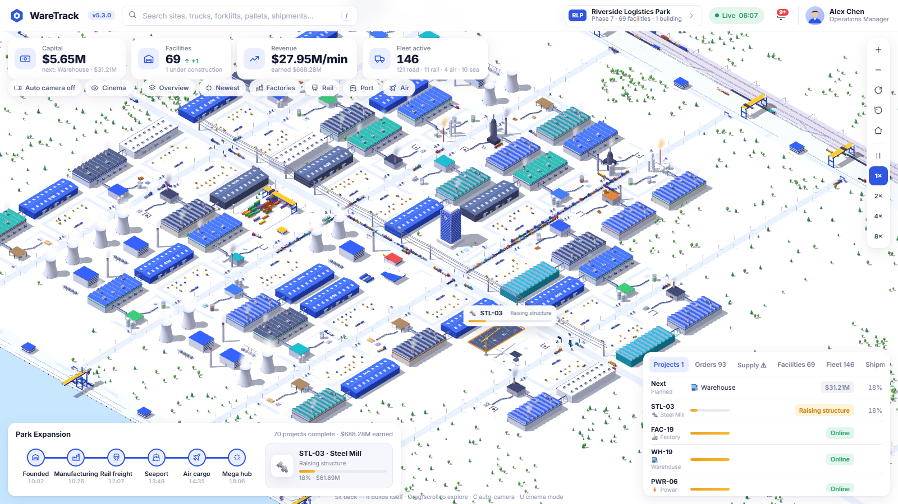
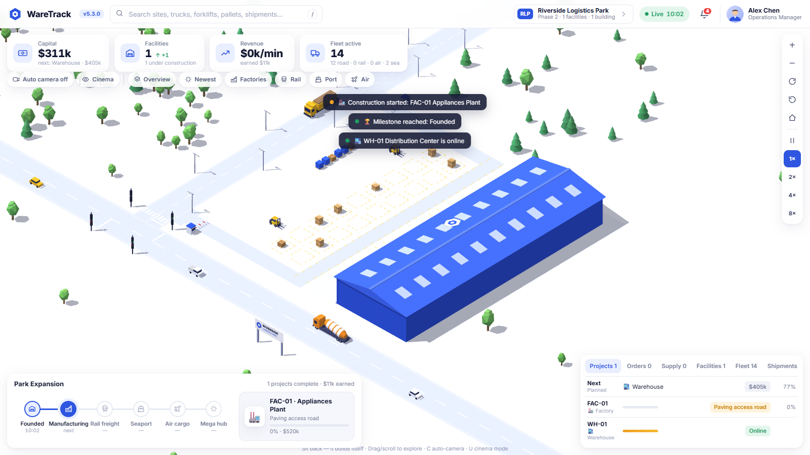
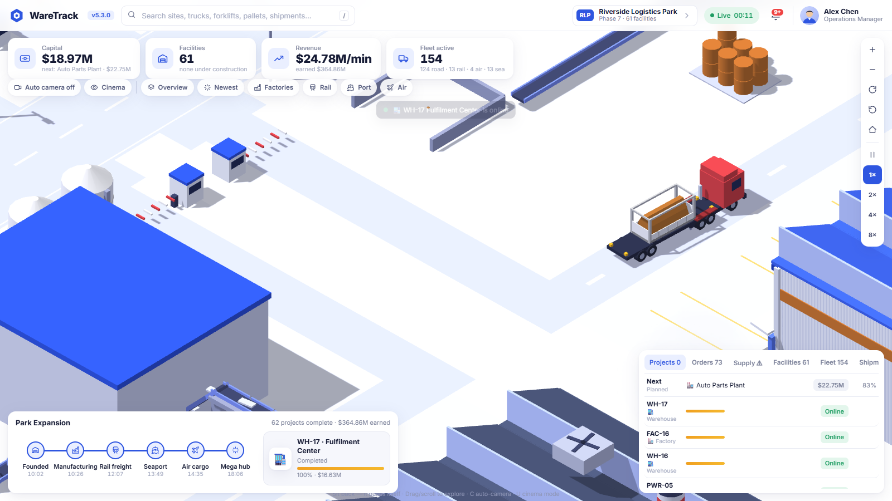
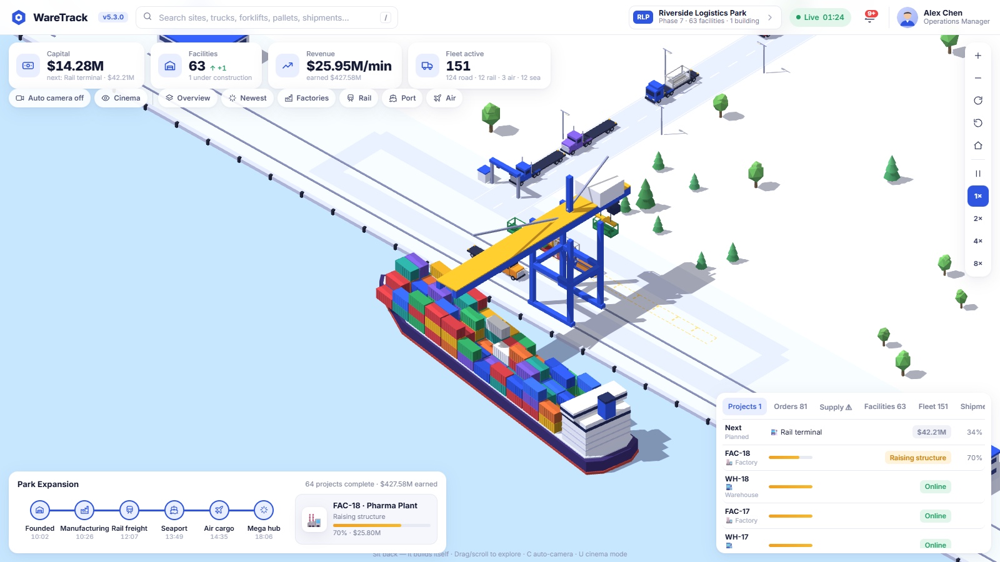
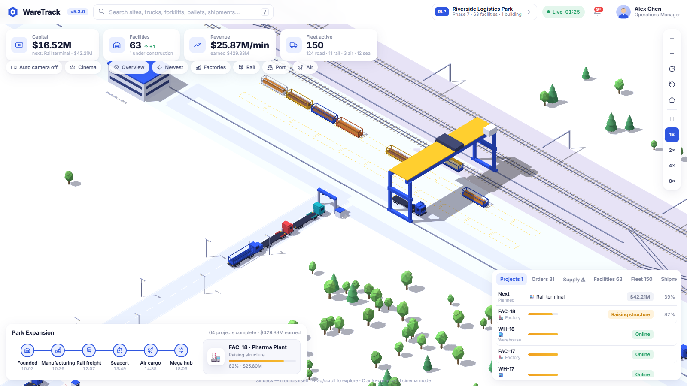
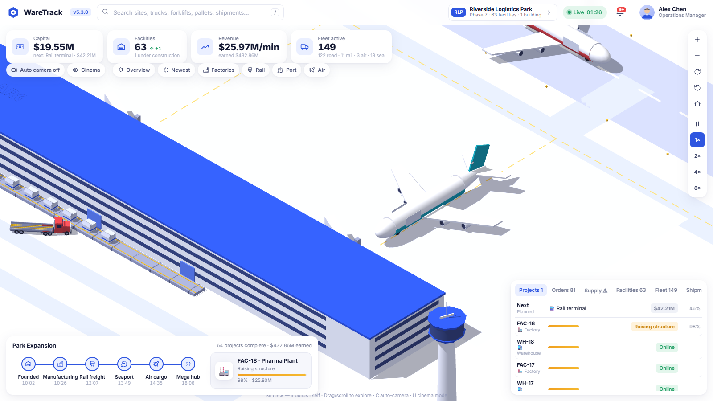
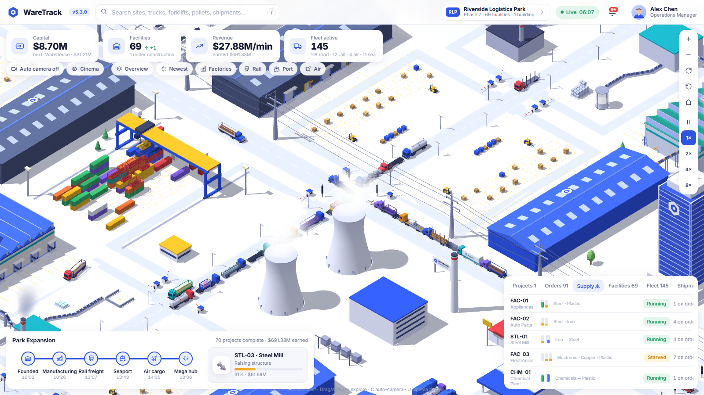
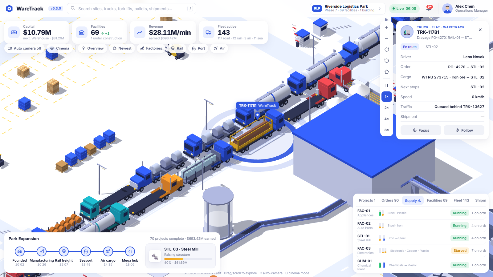
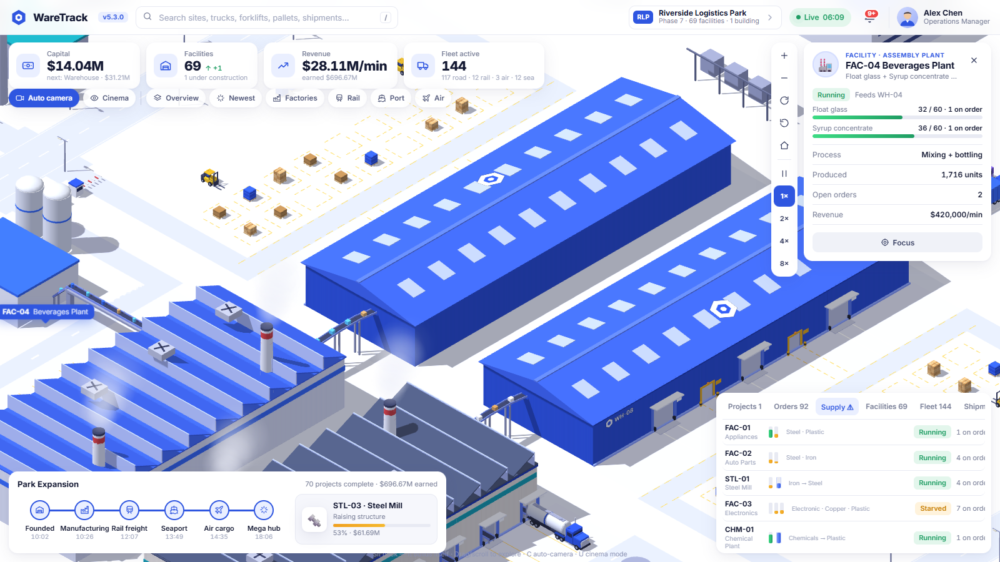

<p align="center">
  
</p>

<h1 align="center">WareTrack</h1>

<p align="center">
  <b>A logistics park that builds and runs itself. Sit back and watch.</b><br/>
  Road, rail, sea and air freight feeding a live, multi-stage supply chain, rendered in isometric 3D in the browser.
</p>

<p align="center">
  <a href="__LIVE_URL__"><b>▶ Live demo</b></a> ·
  <a href="#screenshots">Screenshots</a> ·
  <a href="#run-it-locally">Run locally</a> ·
  <a href="#development">Development</a>
</p>

<p align="center">
  <a href="https://github.com/corund207/waretrack/actions/workflows/ci.yml"></a>
  
  
  
  <a href="LICENSE"></a>
</p>



It starts as empty land with a highway and a forest. A director AI earns capital, plans projects and builds the
park itself: roads get paved, trees cleared, tower cranes go up, mixer trucks pour concrete, and buildings rise floor
by floor. Each new facility then joins a fully simulated supply chain, where every container, ULD and tanker load is
a real object you can click and follow from the ship, train or plane all the way to the factory dock.

No build step and no framework: plain JavaScript and [three.js](https://threejs.org), served as static files.

## Screenshots

| | |
|---|---|
|  **Day one.** Bare land, the first plot being paved and built. |  **Factory receiving.** Trucks reverse onto the dock along an apron lane, belts feed the process line. |
|  **Seaport.** STS cranes discharge the exact containers each purchase order was booked on. |  **Rail terminal.** The gantry grounds boxes while drayage trucks queue through the OCR gate. |
|  **Air cargo.** Freighters turn around at the stands, and ULDs are tugged to the landside rack. |  **Supply panel.** Live plant stockpiles, terminals, depot and road dispatch state. |
|  **Everything is clickable.** A drayage truck with its order, container and traffic state. |  **Cinema mode.** An autonomous camera director with the dashboard hidden. |

## Run it locally

```
python -m http.server 8000
# open http://localhost:8000
```

Opening `index.html` directly also works. three.js is bundled in `js/vendor/`. The version badge next to the logo
shows which build you are looking at (deployed builds also show the commit hash).

## What grows

| Phase | What appears |
|------|--------------|
| Founded | Avenue paved, first **warehouse** with dock bays, apron and yard forklifts, and pallet slots |
| Manufacturing | **Factories**: ore silos → smelter (glowing ingots on an elevated belt) → sawtooth assembly hall → a conveyor bridge carrying cartons into the paired warehouse, with smoking chimneys |
| Rail freight | A track-laying train builds the double-track **mainline**. **Rail terminals** get sidings and a gantry crane, and articulated freight trains stop or run straight through |
| Seaport | **Port terminals** with ship-to-shore cranes. Feeder vessels berth, unload and load, and cargo ships pass offshore |
| Air cargo | **Airfield**, cargo terminal with landside belt docks, 4 stands with ULD tugs, and a control tower. Freighters fly in over the park, land, turn around and take off |
| Mega hub | Power plants with steaming cooling towers and pylon lines, **container depots**, a **truck stop** with fuel canopies and a diner, cold-storage, fulfilment and bulk warehouses, substations, water towers, solar farms, tank farms, an HQ tower and staff parking with shuttle-bus stops, filling about 100 plots across 6 avenues |

Trucks run multi-leg missions over the road network: outbound distribution, inbound replenishment, raw material to
factories, container drayage from rail and port to factories, export boxes to terminals, and air cargo feeders. A full
build-out takes roughly an hour at 1× (use 2×/4×/8× to speed it up).

## Supply chain: order-driven and physically traced

**Purchase orders.** Each plant keeps live stockpiles of its inputs, shown as ore heaps, coil rows, log stacks,
crates and tank levels. When stock plus open orders falls below the reorder point, it raises a purchase order. The
order is routed the way it would be in real life:

| Mode | What happens |
|------|--------------|
| **Sea** | The order is booked on the next vessel. The ship arrives with *that* container on deck, the STS crane discharges it, a drayage truck queues at the terminal gate (OCR check), collects that exact box and delivers it |
| **Rail** | The order rides a specific train's flatcar. The gantry grounds it and a truck drays it to the plant |
| **Air** | The order is built into a ULD on a specific flight. It's tugged off, clears customs and appears on the landside rack, a ULD truck carries it to the plant, and the empty ULD goes back to the airport |
| **Road** | A supplier truck brings it in: tanker, coil flatbed, log trailer, curtainsider, or a container from the interstate |
| **In-park transfer** | A plant-based shuttle truck loads the intermediate product at the producer's shipping bay and drives it to the consumer |

Stock only rises when the delivery is physically received at the dock: containers are opened and destuffed, ULDs
broken down, tankers pumped through a hose. Click any container, ULD or truck to see its order and full journey log.
The **Orders** tab follows every order from placement to delivery.

**Multi-stage industry**

| Primary plant | Turns | Into | Supplies |
|---------------|-------|------|----------|
| Steel Mill | Iron ore (sea/rail) | Steel coils | Appliances, Auto Parts |
| Copper Refinery | Copper ore (sea/rail) | Copper wire | Electronics |
| Chemical Plant | Chemicals (tankers) | Plastic resin | Electronics, Appliances |
| Sawmill | Timber logs | Lumber | Furniture |
| Glass Works | Silica sand (rail) | Float glass | Beverages |

Assembly plants (Electronics, Appliances, Auto Parts, Beverages, Furniture, Pharma) send finished cartons over a belt
bridge into their paired warehouse. From there, goods go out to customers, to the airport, or into export containers
that leave on trains and ships. Until a primary plant exists, its product is bought in by road. The planner builds a new
primary plant once enough assembly lines depend on it. Plants starve, visibly and on their cards, when a delivery is
late, and run out of space ("Output full") when nobody collects.

**Loads you can see.** Raw materials from ships and trains travel in **open-frame containers**: open-tops heaped
with ore or sand, and flat-racks carrying crates or glass on A-frame racks. Cranes lift them with the cargo in plain
view. Utility trailers show what they carry too: steel coils in cradles, log stakes, lumber bundles and wire reels.
At the factory dock each piece is swung off the top of the load onto the dock belt, so the load visibly shrinks until
the bed is bare. At a producer's shipping bay, a shuttle's bed fills from the headboard back as product comes off
the line.

**Distribution centers.** Trucks drive down the yard road, pull past their door and reverse square onto the
dock, guided by bay lines. They pull straight out when they're done. The roller door opens, and a dock forklift
inside drives onto the leveler and puts its forks into the trailer, one pallet at a time. Separate **forklift doors**
between the dock doors, with yellow guard posts and marked walkways, let the yard forklifts carry pallets between
the outdoor yard and the building. They stage stock out when the yard runs low and put it away when it fills up.

**Realistic handling:** terminal appointments with a truck queue at the gate, staging lanes inside plant gates,
street-turned empties, a container depot, and long lead times for sea freight that primary plants buffer against.

## Traffic

- Collision avoidance: each vehicle knows its body shape, follows the car ahead, predicts crossing conflicts and
  yields by right of way (junction > highway > avenue > yard). A deadlock breaker handles circular waits.
- **Queue-actuated traffic signals** at every highway junction. Green time follows the queue on each axis, and a
  signal hands over as soon as its queue is empty and the cross street is waiting.
- **Junction box manager.** Movements whose swept paths would cross never share the box. Opposing through traffic and
  paired right turns go together. No vehicle enters a junction unless its whole body fits beyond the exit
  ("don't block the box").
- **Dispatch metering.** Dispatch watches how much traffic is queued. It meters new truck releases when the roads get
  busy and holds them when they're jammed (see *Supply → Roads*). Finished trucks leave by the nearest exit.
- **Articulated semis.** Every rig is a tractor and a semi-trailer hinged at the fifth wheel. Pulling forward, the
  trailer trails the tractor through bends like a real one and cuts slightly inside. Reversing onto a dock, the
  trailer leads and the tractor follows it in. Collision bodies follow both parts.
- **Off-street docking.** Every unload path is laid out clear of buildings, belts, stockpiles, crane legs and pylons,
  and a geometry audit checks each truck's full body sweep. At factories and the air terminal, trucks pull past the
  bay on an apron lane and **reverse onto the dock**, while traffic behind holds back to give them room. Terminal
  trucks enter and leave the crane lanes from the ends, outside the gantry's travel. Yard forklifts yield to moving
  trucks.
- **Gate barriers** lift for vehicles at every plot entrance. Terminals add an OCR portal where trucks stop for the
  gate-in check.
- The vehicle card's *Traffic* row says why a vehicle is waiting: red light, junction busy, exit blocked, or queued
  behind another vehicle.
- The version is shown next to the logo (currently **v5.3.0**). Hard-refresh (Ctrl+F5) if it doesn't match.
- Vehicle variety: cab-over and long-hood rigs; box, curtainsider, reefer, tanker, coil, log, container and dump
  trailers; concrete mixers; sedans, SUVs, vans, pickups and shuttle buses. Through trains carry tank, hopper and box
  wagons, and tankers and bulk carriers pass offshore.

## Watching

- **Auto camera** (on by default, **C**) cuts to new construction, freighters on approach, trains arriving and ships
  berthing. Between events it follows trucks, shows factory belts and gives slow orbits and overviews. Any mouse or
  keyboard input hands you control, and it resumes after 30 s.
- **Cinema mode** (**U**) hides the dashboard and leaves a slim status ticker.
- Click anything for its live detail card, and use **Follow** to ride along with a vehicle.
- Drag to pan, scroll to zoom, right-drag or **Q/E** to rotate, **H** home, **/** search, **Space** pause, **1–4** set speed.

## Code map

- `js/core.js`: sim clock, coroutines, path following, traffic yielding
- `js/models.js`, `js/models_ext.js`: low-poly models (merged vertex-coloured geometry)
- `js/world.js`: terrain, highway, coast, instanced forest, plot grid, avenue paving, rail line, road router, pylons
- `js/fx.js`: smoke, steam and dust particles, and instanced conveyor belts
- `js/fac_*.js`: facilities (warehouse, factory, rail, port, airport, depot and truck stop, misc)
- `js/traffic.js`: traffic engine (avoidance, signals, gates), vehicles, multi-leg missions, ambient traffic
- `js/supply.js`: materials, recipes, container contents and journeys, demand-driven dispatcher
- `js/models_fleet.js`: rigs and trailers, cars and buses, wagons, ships, signals, barriers, lamps
- `js/growth.js`: economy, project planner, construction sequence, milestones
- `js/cinema.js`: autonomous camera director
- `js/ui.js`, `js/main.js`: dashboard, renderer, input, overlays, main loop

## Development

```
npm install            # dev dependency: puppeteer (headless Chrome for the tests)
npm test               # static checks → build → simulation test
npm run screenshots    # regenerate docs/screenshots and docs/social-preview.png
```

- `npm run test:static` parses every script, makes sure every asset referenced by `index.html` exists, and checks that
  every cache-busting tag matches `WT.VERSION`.
- `npm run build` copies the site to `dist/` and stamps it with the commit hash. Each deploy busts browser caches,
  and the badge shows the exact build.
- `npm run test:sim` boots the built site in headless Chrome with a fixed random seed and grows the park through
  most of a day. It fails on any page error, on stalled growth or unfed factories, on vehicles piling into each
  other or traffic locking up, or if any truck path (docks, reverse manoeuvres, staging lanes, public roads)
  sweeps through a building, belt, stockpile, crane or tree.

### CI / CD

[`.github/workflows/ci.yml`](.github/workflows/ci.yml) runs on every push and pull request:

1. **Test**: static checks, build, then the full simulation test.
2. **Deploy**: only runs if the tests pass. `main` goes to **production** on Vercel, and other branches get a
   **preview** URL.

Deployment needs three repository secrets: `VERCEL_TOKEN`, `VERCEL_ORG_ID` and `VERCEL_PROJECT_ID`. Vercel's own
Git auto-deploys are switched off in `vercel.json`, so nothing reaches the live site without passing CI.

## License

[MIT](LICENSE). three.js is © Three.js Authors (MIT).

